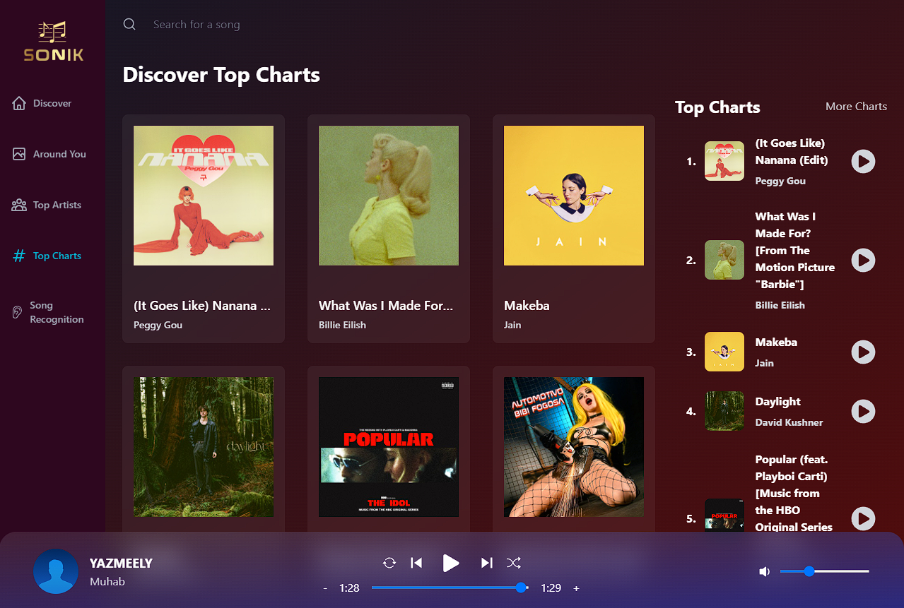

&nbsp;&nbsp;&nbsp;&nbsp;&nbsp;&nbsp;

  <h1 align="center">Chatvia</h1>

    <a style="display:flex;justify-content:center;margin-bottom:1rem; font-weight:bold;" href="https://sonik-app-khaled.netlify.app/">Demo</a>

## Introduction

Sonik is a shazam like app with song recognision feature and songs near you based on your location.

## Demo

Explore my demo Sonik app.

  

## Support

If you like my work, feel free to:

- ⭐ this repository. It helps.

### Create a bug report

If you see an error message or run into an issue, please [create bug report](https://github.com/khaleddrashadd/sonik/issues). This effort is valued.

